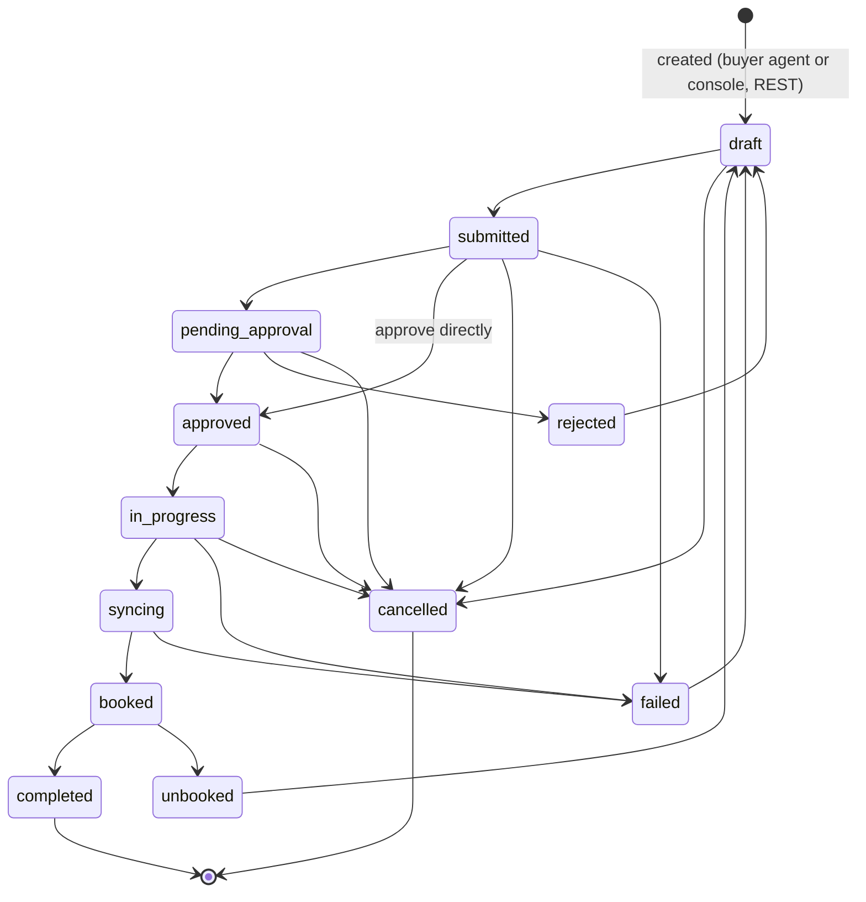
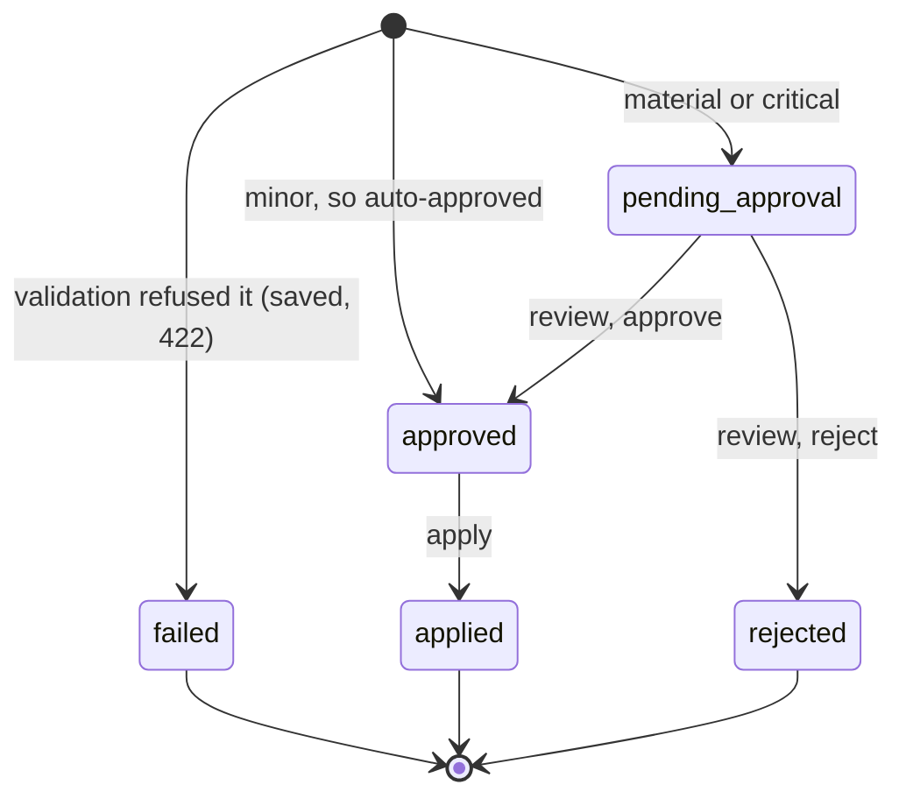

# Orders: states, paths, and who can move them

This page maps what an order and its change requests can do, and who can make each
move: this console, Claude Code over the agent's MCP server, a buyer agent over REST,
or nothing automatic at all. The Orders screen is built to show every one of these
states and paths. When the agent changes, re-check this page against the sources it
cites.

Read against the seller agent at commit `938f7ea`. File references are to that
repository (`src/ad_seller/…`). The fields were confirmed against a live agent
2.4.2 on 2026-09-29.

## Nothing moves an order on its own

This is the fact that shapes everything else. `order_service.transition_order` is the
only code that moves an order. Two things call it: the REST route
`POST /api/v1/orders/{id}/transition` and the MCP tool `transition_order`. No flow,
ad-server sync, approval gate, event subscriber or change request calls it, and no
guard conditions are registered. So:

- **Every waiting order waits on a person.** Submitted, pending approval, rejected and
  failed orders stay where they are until someone moves them.
- **The ad-server states are claims, not readings.** `in_progress`, `syncing` and
  `booked` are set by hand. The agent never checks the ad server.
  `ExecutionActivationFlow` creates ad-server orders, but nothing calls it, and it
  does not touch stored orders.
- **An order at `pending_approval` is in no queue.** Approvals exist only for
  proposals (`negotiation_service.py`), so the Inbox and the MCP
  `list_pending_approvals` tool never show an order.
- **Transitions emit no events.** The event stream says nothing about orders.

## Order states

Every arrow after creation is a manual transition: the console's Next step buttons,
or `transition_order` from Claude Code. The table the console mirrors is
`_DEFAULT_TRANSITIONS` in `models/order_state_machine.py`, pinned by
`tests/unit/order-lifecycle.test.ts`. If the agent refuses a move with a 409, the
console shows the agent's own `allowed_transitions`, so a stale copy of the table
still reports correctly.

The screen groups the twelve states the way the operator meets them:

| Group | States | Waiting on |
|---|---|---|
| Intake | draft, submitted | The seller: submit it, send it for approval or approve it, or cancel it |
| Approval | pending approval | The seller: approve or reject it. No approval queue lists it |
| Execution | approved, in progress, syncing, booked | Whoever watches the ad server, stepping it along by hand |
| Rework | rejected, failed, unbooked | The seller: return it to draft, or leave it |
| Closed | completed, cancelled | Nothing. These are terminal |

### Who is recorded as having moved it

The agent stores whatever actor the caller sends. The convention is `system`,
`human:<id>` or `agent:<id>`, and the orders report groups actors by that prefix.

- **REST transition route.** Records the actor from the request body, or `system` if
  none is sent. The console sends `human:<name>`, using the name stored with the
  credential.
- **MCP `transition_order`.** Sends no actor, so every move made from Claude Code is
  recorded as `system`, whoever is signed in.

The timeline therefore labels each actor by kind, and says what `system` can mean.

## Change requests

A change request proposes edits to an order. It has its own lifecycle, and none of
it moves the order.

- **Who creates one.** Anyone, over REST. A buyer agent is the usual source. The
  console does it from an order's row. `idempotency_key` is required.
- **Severity decides the path.** This is `classify_severity` in
  `models/change_request.py`.
  - Minor, auto-approved as `system:auto-approve`: `creative`, and `flight_dates`
    when the shift is 3 days or less.
  - Material: `impressions`, `targeting`, `other`, and larger `flight_dates` shifts.
  - Critical: `pricing` and `cancellation`.
  - Material and critical are routed identically: both wait for review.
- **Refusals.**
  - An order with no `deal_id` gets a 400, and nothing is saved.
  - An order that is completed, cancelled or failed gets a 422, and the request is
    saved as `failed` with its `validation_errors`.
  - So does a cancellation while the order is syncing, rejected or unbooked.
- **Review and apply need an operator key.** Apply requires `approved`.
- **Apply writes into the order's `metadata`, and nothing else.**
  - It merges in `proposed_values` and records each diff as `_changed_<field>`.
  - It never changes the order's status.
  - **An applied cancellation does not cancel the order.** The console says so and
    points at the Cancel order transition.
- **A pending change request is in no queue either.** It is not an approval, and the
  MCP server has no change-request tools. The console's order row and Change
  requests screen are the only places it can be decided.

## The journey, by who does it

| Step | Buyer agent (REST) | Console | Claude Code (MCP) |
|---|---|---|---|
| Quote, book the deal | `POST /api/v1/quotes`, `POST /api/v1/deals` | Deals, Catalog | `request_quote`, `create_deal_from_template` |
| Create the order | `POST /api/v1/orders` with `deal_id`, `quote_id` | New order | none |
| See what needs doing | — | Orders summary chips, Next step and Changes columns | `list_orders` (no filter; `limit` ignored) |
| Move the order | not allowed (operator key) | Next step buttons | `transition_order` (recorded as `system`) |
| Read its history | `GET …/history`, `…/audit` | Timeline in the row | none |
| Request a change | `POST /api/v1/change-requests` | Request a change in the row | none |
| Review or apply a change | not allowed (operator key) | In the row, or Change requests | none |
| See what a change did | `GET /api/v1/orders/{id}` (`metadata`) | Recorded on the order, in the row | none |
| Close | — | Record completed, or Cancel order | `transition_order` |

## Gaps in the agent's MCP server

These are upstream issues, not work for this repository. They are why an operator
working only from Claude Code cannot see the whole order story:

- **No tool to create an order**, read one, or read its history or audit.
- **No change-request tools at all**, so pending and approved-not-applied requests are
  invisible over MCP.
- **`transition_order` drops the actor**, so every move reads as `system`. Its
  docstring also gives the example `draft→approved→delivering`, which is neither a
  legal path nor a real state.
- **`list_orders` has no status filter and ignores its `limit` parameter.**
- **The orders report promises "average time-in-state metrics" and computes none.**
  The console derives time in state from each order's audit instead.
